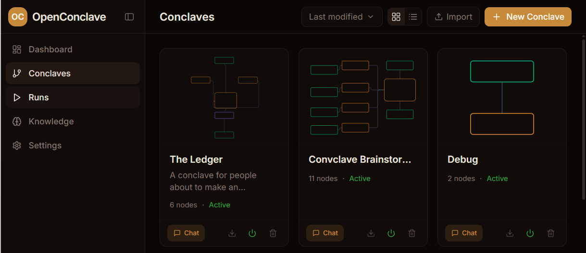

# Starter Conclaves

Importable conclave definitions for [OpenConclave](https://github.com/openconclave/oc). Drop the `.json` file into your OC instance to try it out.

## How to import

1. Open your OC instance (default: `http://localhost:4000`)
2. Go to **Conclaves**
3. Click **⬇ Import** (top right, next to "New Conclave")
4. Select the `.conclave.json` file (or paste its raw GitHub URL)
5. Map the role placeholders to your own providers (Claude / OpenAI / Ollama)
6. Hit **Run** (or **Chat** if the trigger is chat-based)

  

Each conclave below lives in its own folder with a `.conclave.json` (the definition) and a `README.md` (what it does and how to use it).

## Available

| Starter | What it does | Requires |
|---|---|---|
| **[Code Review](./code-review)** | Deep review of a single file. Context Reader + Usage Analyst gather facts; 5 specialists (correctness, security, tests, conventions, design) work in parallel; a Best Practices agent enriches with KB + web; Lead Reviewer synthesizes; Writer formats the output. 16 nodes, KB-backed, learning-capable. | Anthropic API key (and optionally an OpenAI-compatible provider) |
| **[The Ledger](./the-ledger)** | For people about to make an irreversible decision — quit, leave, sign, commit. Two agents build sunk-cost and opportunity-cost lists; a code node mechanically detects items that describe the same underlying pattern. You read the highlighted ledger and decide. | Anthropic API key, Ollama with `nomic-embed-text` |

## Coming soon

- **Brainstorm** — Agents pitch ideas, a critic tears them apart, a moderator steers the debate. You get a structured verdict — not a list of bullet points.
- **Three Advisors** — Ask any question. Three agents answer independently, then a fourth merges their perspectives into one response.
- **Agent Mafia** — AI agents play Mafia against each other. You just watch.

Pull requests welcome.

## License

MIT — use, remix, ship.
