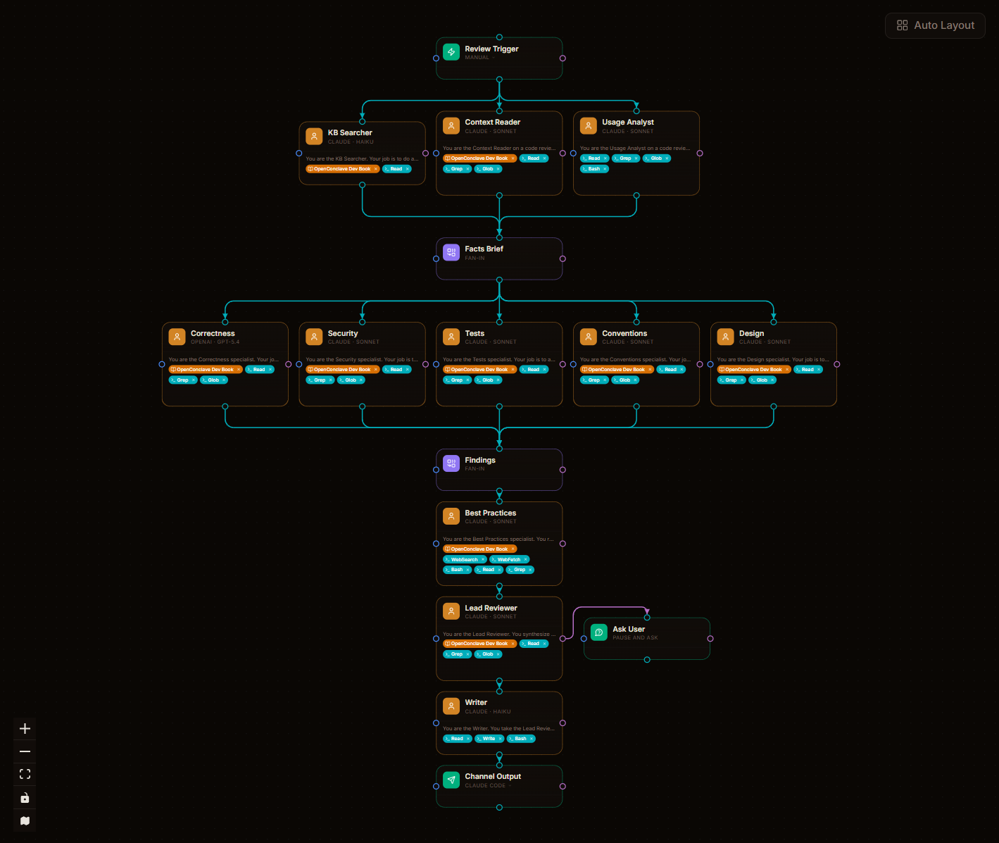

# Code Review

A deep, multi-agent code review pipeline for a single file. Five specialist reviewers work in parallel after a fact-gathering phase; a synthesis layer turns their findings into one coherent verdict; the conclave learns across runs by writing lessons back to a knowledge base.

This is not a "review my PR" wrapper around one LLM call. It's a 16-node graph with a deliberate division of labor.

<p align="center">
  
</p>

## What it does (per run)

1. **Trigger** — manual, with the file path and any context you want to pass in.
2. **Fact gathering — runs in parallel:**
   - **KB Searcher** — sweeps the attached knowledge base for prior lessons relevant to the file's domain
   - **Context Reader** — reads the file and produces a structured "what this code is and what it claims to do" brief
   - **Usage Analyst** — searches the codebase for callers, tests, and dependents — produces a "how this is used" brief
3. **Facts merge** — the three briefs are combined into one Facts Brief that downstream specialists work from.
4. **Five specialists in parallel** (each with its own focused system prompt):
   - **Correctness** — bugs, edge cases, race conditions, off-by-one, type errors
   - **Security** — auth bypasses, injection, secrets handling, OWASP categories
   - **Tests** — coverage gaps, brittleness, missing assertions, false positives
   - **Conventions** — house style, naming, layering violations, project-specific rules
   - **Design** — maintainability, abstractions, coupling, refactor opportunities
5. **Findings merge** — all five reports combined.
6. **Best Practices** — a KB-first / web-second specialist that enriches the findings with relevant patterns and writes new lessons back to the knowledge base for future runs.
7. **Lead Reviewer** — synthesizes everything (facts + findings + best practices) into one prioritized markdown verdict with severity tags, line numbers, and proposed fixes.
8. **Ask User** (channel loop) — pauses and asks you (via Claude Code) any clarifying questions the Lead Reviewer needs before finalizing.
9. **Writer** — formats the final output for delivery.
10. **Channel output** — delivers the review back to your active Claude Code session.

## Why the topology earns its complexity

A single LLM asked to "review this file" produces a generic, hedge-everything bullet list. This conclave forces specialization: each specialist sees only the Facts Brief and produces output in its own narrow lane, so they can't homogenize. The Lead Reviewer is the only agent that sees everything, and its job is synthesis, not first-pass analysis. The KB-backed Best Practices specialist is what makes the whole thing get smarter over time — every review writes back lessons that the next review consults first.

## Structure

```
Trigger
   │
   ├──→ KB Searcher
   ├──→ Context Reader        ─┐
   └──→ Usage Analyst          ├─→ Facts Brief (merge)
                                │
   ┌────────────────────────────┘
   │
   ├──→ Correctness    ─┐
   ├──→ Security        │
   ├──→ Tests           ├─→ Findings (merge)
   ├──→ Conventions     │
   └──→ Design          │
                         │
              ┌──────────┘
              │
   ┌──→ Best Practices (KB + web; writes back to KB)
   │
   └──→ Lead Reviewer
              │
              ├──→ Ask User (channel loop, optional clarification)
              │
              └──→ Writer ──→ Channel Output
```

## Roles in the export

When you import this conclave, the role-mapping dialog will ask you to assign:

- **role-1** (Claude haiku) — used by KB Searcher and Writer (cheap models for fast / light tasks)
- **role-2** (Claude sonnet) — used by Context Reader, Usage Analyst, Security, Tests, Conventions, Design, Best Practices, Lead Reviewer (the bulk of the thinking)
- **role-3** (OpenAI-compatible gpt-5.4) — used by Correctness (intentionally a different family for second-opinion diversity)

You can map all three to the same provider/model if you don't have an OpenAI-compatible setup. The Correctness specialist will still work; you just lose the cross-family diversity.

## Knowledge base

The conclave references one KB — by default it'll be created empty on import under the name "OpenConclave". For best results, populate it with your own coding standards, past review findings, common bug patterns from your codebase. Every run by the Best Practices agent adds new lessons; over time, the conclave gets sharper for *your* code.

## Requirements

- **OpenConclave** — https://github.com/openconclave/oc
- **Anthropic API key** — for most agents
- **OpenAI-compatible API** (optional) — for the Correctness specialist's diversity
- **A populated KB** (optional but recommended) — empty KB still works; populated KB gets dramatically better results

## How to import

```
Conclaves → ⬇ Import → paste this URL or drop code-review.conclave.json:
https://raw.githubusercontent.com/openconclave/conclaves/main/code-review/code-review.conclave.json
```

## License

MIT.
